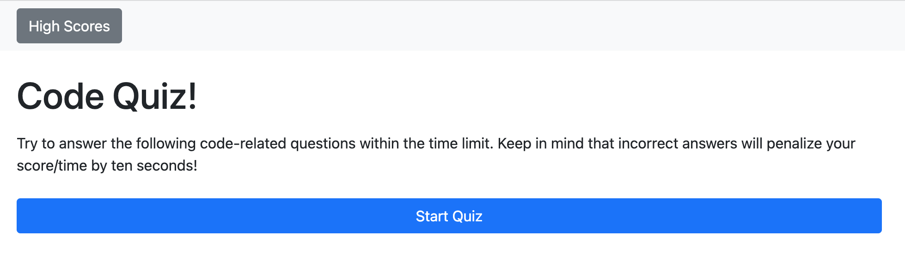

# fuzzy-robot

## Week 5 Assignment: Code Quiz

This is an application that uses HTML, CSS (Bootstrap) and JavaScript. It iterates through questions and checks answers with each button press against the correct answer of each question. With wrong answers, 10 seconds is subtracted. At the end, the user can submit their name into the leaderboard.

---
## Project links

- [GitHub Repository][1]
- [GitHub Page][2]

[1]: https://github.com/D1sl/fuzzy-robot/
[2]: https://d1sl.github.io/fuzzy-robot/

---
GitHub: [D1sl](https://github.com/D1sl/) 
